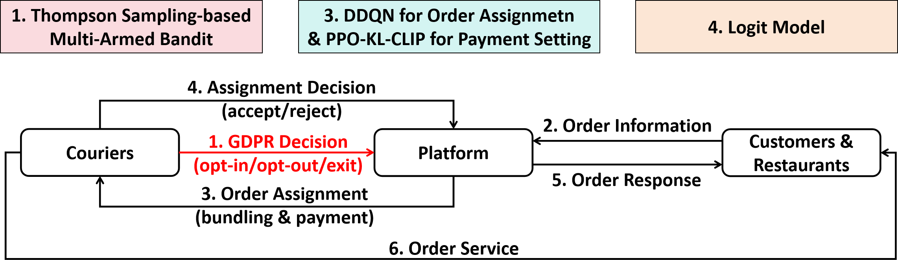
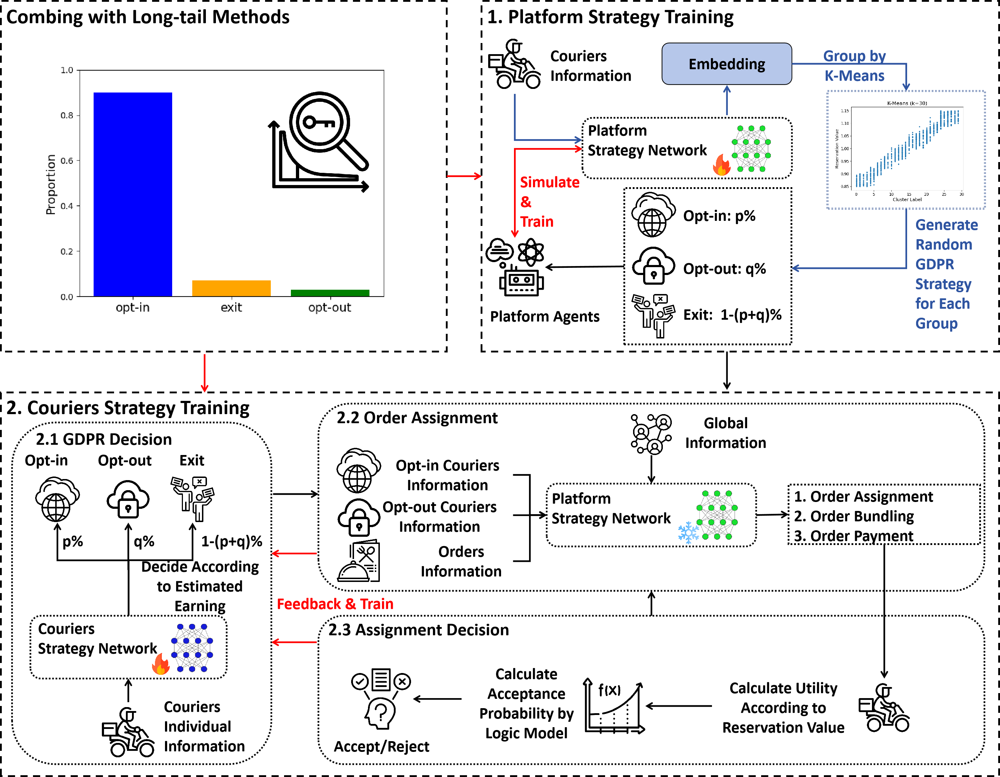
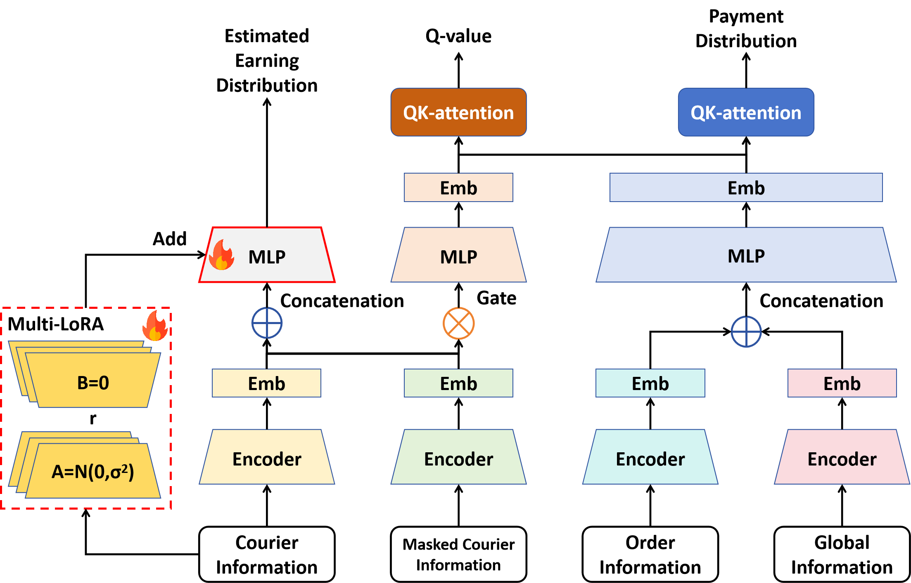

# GFD: GDPR Food Delivery
**Article:**


## 1. Workflow







## 2. Dataset

Please refer our previous work [RS2002/Double-PDF: Official Repository for The Paper, Discriminatory Order Assignment and Payment-Setting on Food-Delivery Platforms: A Multi-Action and Multi-Agent Reinforcement Learning Framework](https://github.com/RS2002/Double-PDF).


## 3. How to Run

### 3.1 Platform Training

#### 3.1.1 Pre-training

```

```


#### 3.1.2 Fine-tuning

```shell

```


### 3.2 Courier Training

```shell

```


### 3.3 Evaluation

```

```


## 4. Reference

```

```

