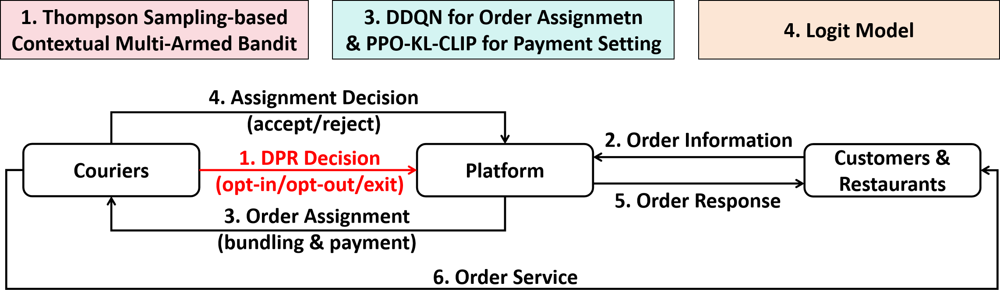

# FFD: Fair Food Delivery
**Article:**


## 1. Workflow




## 2. Dataset

Please refer our previous work [RS2002/Double-PDF: Official Repository for The Paper, Discriminatory Order Assignment and Payment-Setting on Food-Delivery Platforms: A Multi-Action and Multi-Agent Reinforcement Learning Framework](https://github.com/RS2002/Double-PDF).


## 3. How to Run

### 3.1 Pre-train

```shell

```


### 3.2 Fine-tune

```shell

```


## 4. Reference

```

```

